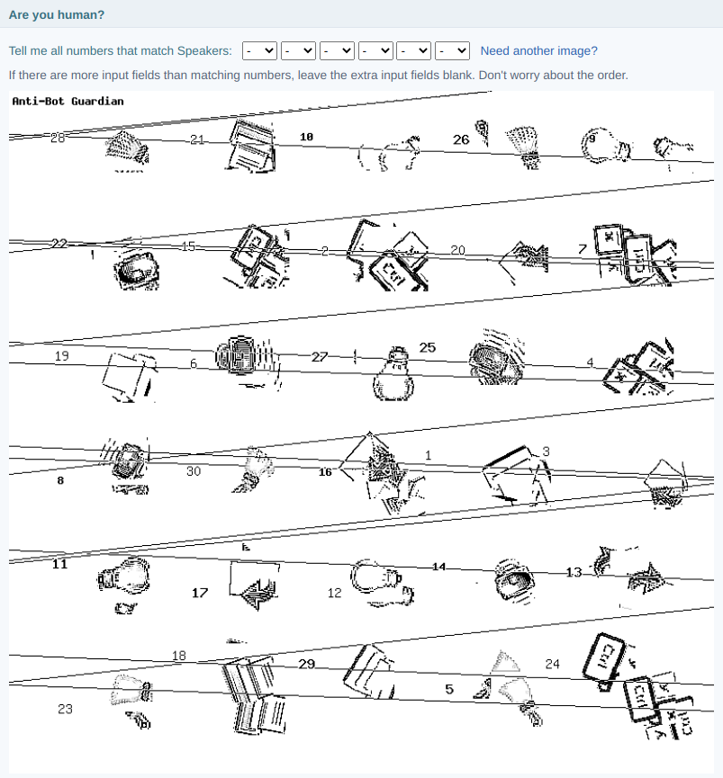

# Anti-Bot Guardian

Stop spam bots from signing up to your forums using Anti-Bot Guardian, a domain-specific captcha system that is tailored to your own unique content.

Anti-Bot Guardian generates unique visual challenges based on icons you provide. It's easy to setup and requires no external services. It's compatible with [FluxBB](https://fluxbb.org) and can easily be adapted to other PHP-based software.

Anti-Bot Guardian is developed by [Alexandre Martins](https://github.com/alemart), a computer scientist from Brazil. It's released under the [MPL 2.0](LICENSE) license.




## Installing on FluxBB

### Prerequisites

1. You have access to your web hosting and can upload files.
2. Your PHP build has [GD Image Library support](https://www.php.net/manual/en/book.image.php). Upload and open file *gd_info.php* in order to test this. Remove the file afterwards.
3. FluxBB 1.5.8 or later.

### Basic setup

1. Upload folders *addons/* and *lang/* to your forum directory.

2. Edit file *addons/antibot/config.php* and change the entry *CHALLENGE_SECRET_KEY* to some unique random string you come up with in your mind. Examples: `"theSecretPlaceOfTheMostHigh"`, `"let-me-share-a-secret-with-you"`, `"c0ffee lover 512k"`. Save & upload.
```php
// For example, the line:
define("CHALLENGE_SECRET_KEY", "Type a secret key here!");

// becomes: (use your own key instead)
define("CHALLENGE_SECRET_KEY", "c0ffee lover 512k");
```

3. You should see a challenge show up in your registration page. Go to your forum and test it out.

### Customize the icons

**Customizing the icons is highly recommended.** Do not use the icons that are provided by default. Those are distributed with this software for demonstration purposes and are publicly known. Use your own custom icons, i.e., icons that the bots don't know in advance.

1. Edit file *addons/antibot/config.php* once again and change the entry *CHALLENGE_ICON_FOLDER* to some unique random string you come up with in your mind. This string **must not** have special characters. Examples: `"monkey51"`, `"giraffe456"`, `"blue_whale36"`. Save & upload.
```php
// For example, the line:
define("CHALLENGE_ICON_FOLDER", "rename_this_folder");

// becomes: (use your own folder name instead)
define("CHALLENGE_ICON_FOLDER", "blue_whale36");
```

2. Rename folder *addons/antibot/rename_this_folder/* to the name you have just chosen. This folder is meant to store your custom icons and **should not** be visible to the public (bonus points if you can make it unavailable to the public).

3. Remove all .png files from that folder and upload your own. Use icons that your users can recognize. The names of the files should describe the icons, but at the same time should be broad enough, so that a machine can't easily recognize them.

4. Use an icon theme specific to your website. The more icons you have, the better.

Anti-Bot Guardian ships public domain icons obtained from the [Tango Desktop Project](http://tango.freedesktop.org).


## Using with other software

Anti-Bot Guardian can be used with any PHP-based software. While originally designed for FluxBB, the only file that is FluxBB-specific is *addons/antibot.php*. This file installs hooks on the registration page. Those hooks call the underlying system, which is platform-agnostic. Therefore, it's easy to port it to other software.
